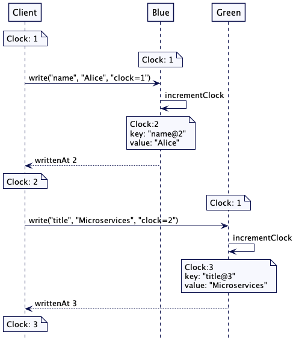

### Lamport Clock

---

Use logical timestamps as a version for a value to allow ordering of values across servers

References:  
https://martinfowler.com/articles/patterns-of-distributed-systems/lamport-clock.html 

---

  
Figure 1: Two servers each responsible for specific keys

  
Figure 2: Two servers each responsible for specific keys

  
Figure 3: Different leader folower groups storing different key values

  
Figure 4: Partial Order

  
Figure 5: Single leader-follower group saving key values