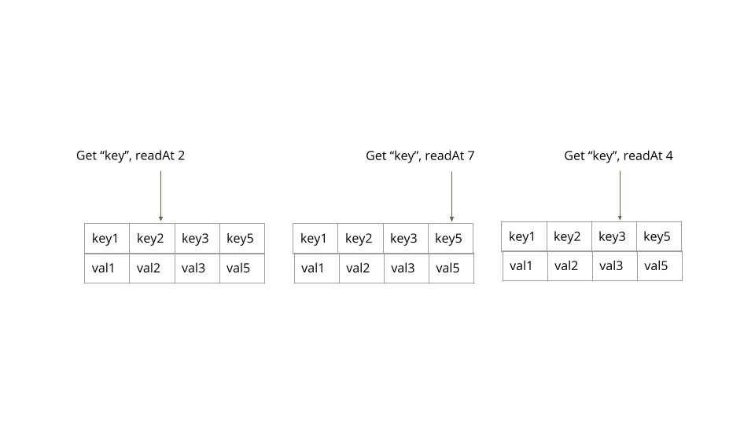
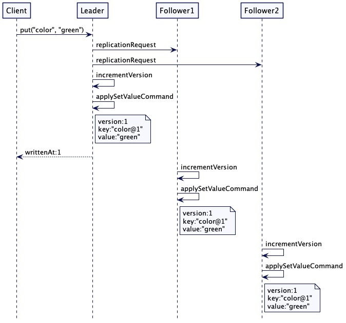
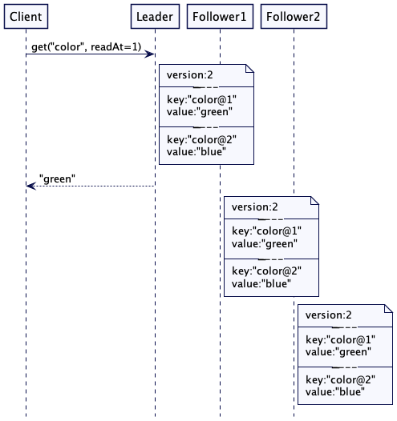
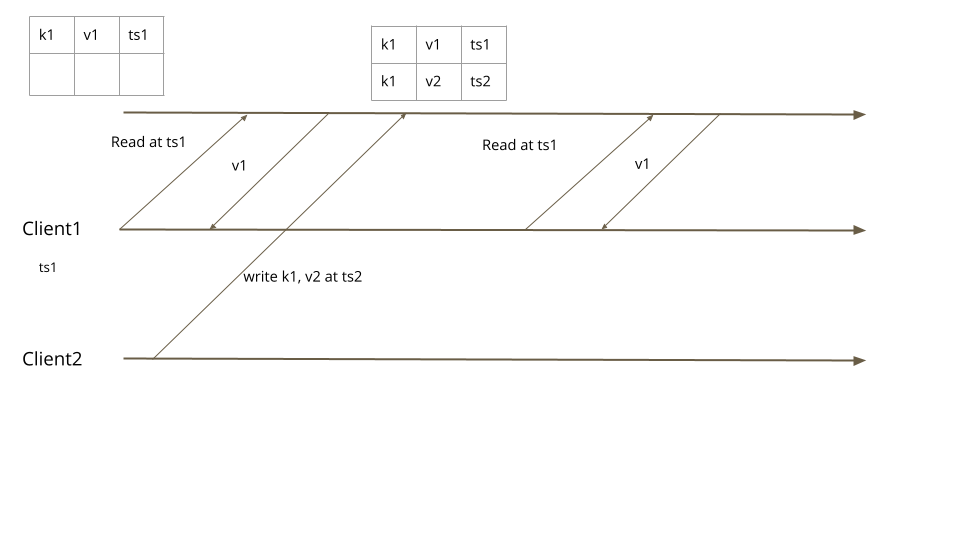

### Versioned Value

---

Store every update to a value with a new version, to allow reading historical values.

References:  
https://martinfowler.com/articles/patterns-of-distributed-systems/versioned-value.html 

---

  
Figure 1: Reading a specific version

  
Figure 2: Put request handling

  
Figure 3: Reading a specific version

  
Figure 4: Reading snapshot